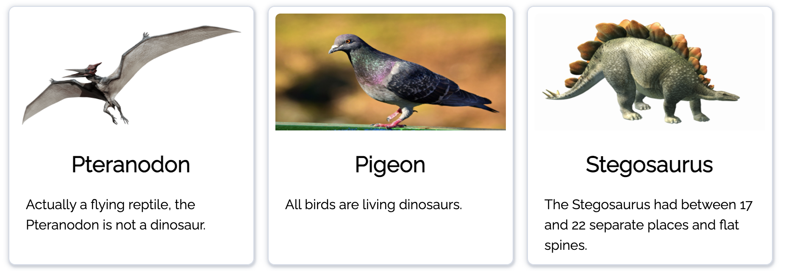

# Dinosaurs Project

### Technologies
- HTML
- CSS
- JS

### Setup instructions
Install them globally in your PC.

Use either:
- [Chrome Web Server](https://chrome.google.com/webstore/detail/web-server-for-chrome/ofhbbkphhbklhfoeikjpcbhemlocgigb?hl=en)
- [http-server](https://www.npmjs.com/package/http-server)
- [live-server](https://www.npmjs.com/package/live-server)

Start up the server and go to the root route. You should be able to see something like this(hopefully):

And see this when you submit a valid form:

### Demo
#####  Form input styling

##### Validation errors

