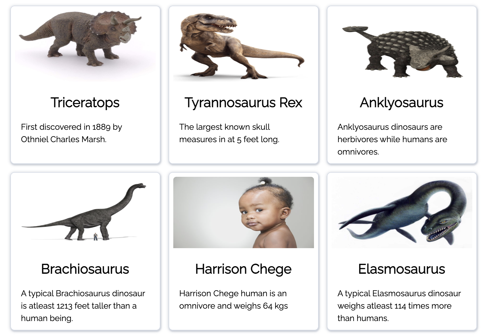

# Dinosaurs Project
Udacity nanodegree's accreditation project. See the screenshots below on how the app works and feels.

## Overview
Gets human data from the HTML form and builds your human object.

The form displays validation errors in the event the data being sent is not valid.

A grid is shown once the `Compare Me` button is clicked with the form data duly provided.

Under the hood, 3 methods compare dino data to human data. The methods randomly pick up dinosaurs and generates random facts based of their comparison to similar human statistics.

A grid of 3 X 3 tiles is generated using JavaScript & CSS and appended to the DOM. Each Dino tile includes at least the species, an image and a fact. The human tile is located at the middle of the grid

The grid only shows when a valid form is submitted.

Hovering over each tile displays the underlying object's statistics.

## Technologies
- HTML
- CSS
- JS

## Setup instructions
Install them globally in your PC.

Use either:
- [Chrome Web Server](https://chrome.google.com/webstore/detail/web-server-for-chrome/ofhbbkphhbklhfoeikjpcbhemlocgigb?hl=en)
- [http-server](https://www.npmjs.com/package/http-server)
- [live-server](https://www.npmjs.com/package/live-server)

Start up the server and go to the root route. You should be able to see something like this(hopefully):

And see this when you submit a valid form:

Attempting to submit an invalid form with display something likes this:

